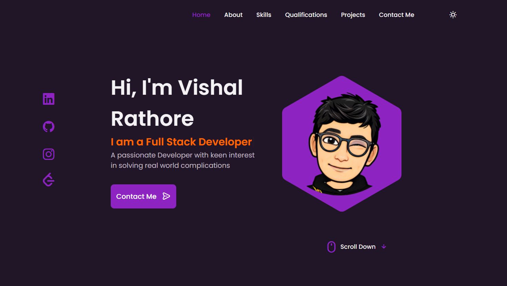
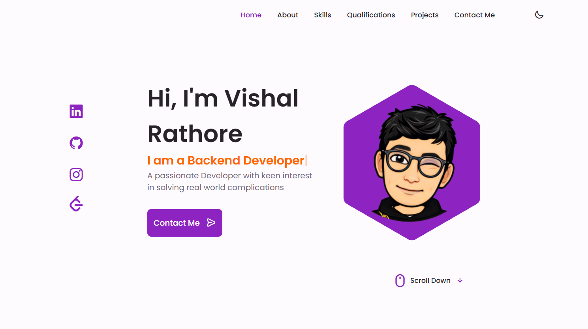
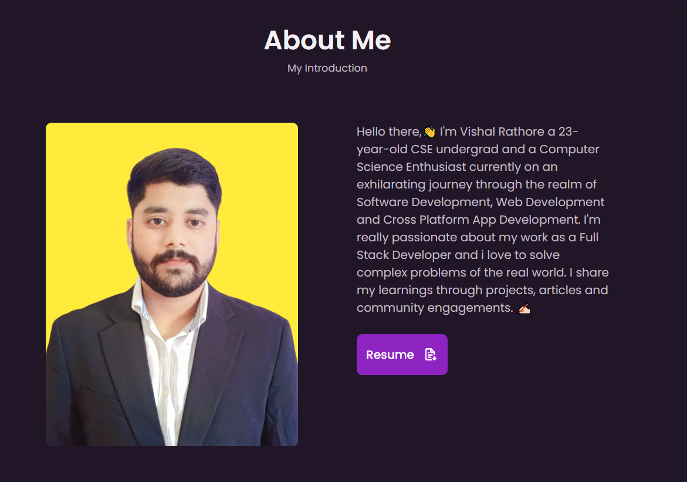
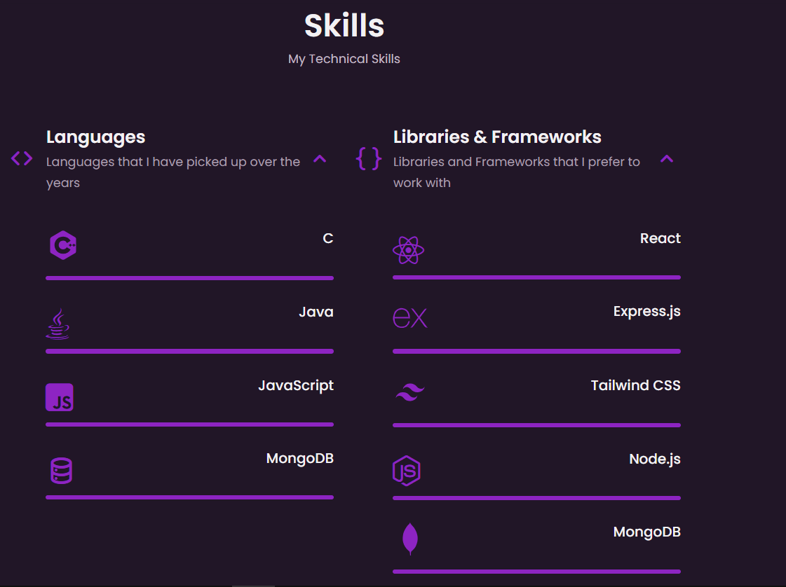
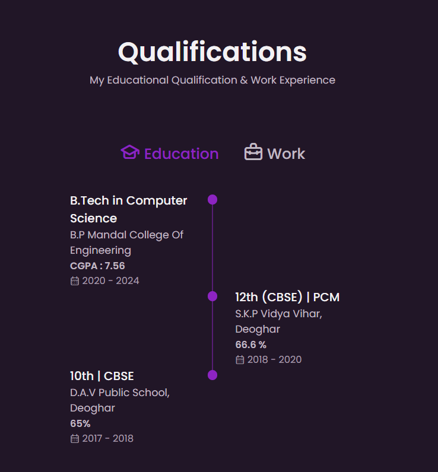
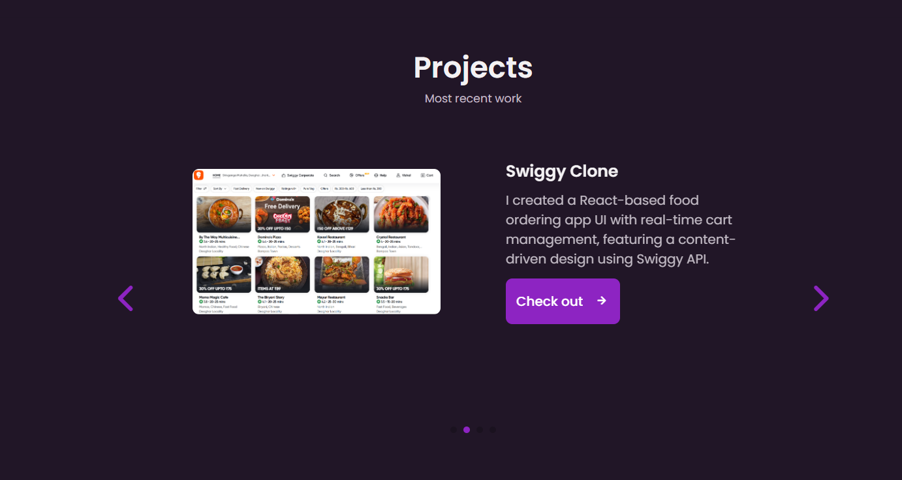
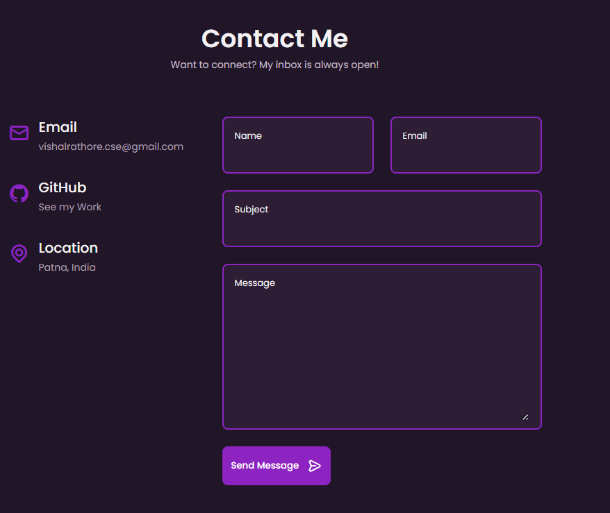

# Responsive Portfolio Website 

## About the Project

This is a responsive personal portfolio website built using HTML, CSS, and JavaScript. The website is designed to showcase personal projects, skills, and contact information in a visually appealing and user-friendly manner.

### Features

- **Responsive Design**: The website is fully responsive and works seamlessly on all devices, including desktops, tablets, and mobile phones.
- **Smooth Scrolling**: Each section of the website features smooth scrolling for a better user experience.
- **Light and Dark Mode**: Users can switch between light and dark modes to suit their preferences.
- **Mobile First Approach**: The website is developed with a mobile-first methodology, ensuring it looks great on smaller screens before adapting to larger screens.
- **Cross-Browser Compatibility**: The website is compatible with all modern browsers, providing a consistent experience across different platforms.

## Project Screenshots

Here are some screenshots of the project:

## Getting Started

To get a local copy up and running, follow these simple steps.

### Prerequisites

Make sure you have a modern web browser installed.

## Usage

Feel free to explore the project, customize it to your liking, and use it as a template for your own portfolio website.

